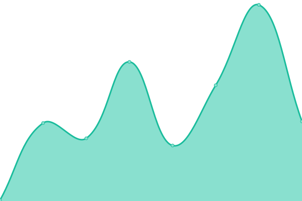

# [📈 Live Status](https://navaneethkm004.github.io/uptime): <!--live status--> **🟧 Partial outage**

This repository contains the open-source uptime monitor and status page for [Navaneeth K M](https://navaneethkm004.github.io/uptime), powered by [Upptime](https://github.com/upptime/upptime).

With [Upptime](https://upptime.js.org), you can get your own unlimited and free uptime monitor and status page, powered entirely by a GitHub repository. We use [Issues](https://github.com/navaneethkm004/uptime/issues) as incident reports, [Actions](https://github.com/navaneethkm004/uptime/actions) as uptime monitors, and [Pages](https://navaneethkm004.github.io/uptime) for the status page.

<!--start: status pages-->
<!-- This summary is generated by Upptime (https://github.com/upptime/upptime) -->
<!-- Do not edit this manually, your changes will be overwritten -->
<!-- prettier-ignore -->
| URL | Status | History | Response Time | Uptime |
| --- | ------ | ------- | ------------- | ------ |
|  [Cache Server](https://www.cloudflare.com) | 🚨 Down | [cache-server.yml](https://github.com/FOX-X-BOT/Stark-Status/commits/HEAD/history/cache-server.yml) | 

 139ms
     
 | 

<a href="https://starkindustrystatus.vercel.app/history/cache-server">99.88%</a>
    

|  [Permanent Drives](https://www.mongodb.com) | ✅ Up | [permanent-drives.yml](https://github.com/FOX-X-BOT/Stark-Status/commits/HEAD/history/permanent-drives.yml) | 

 517ms
     
 | 

<a href="https://starkindustrystatus.vercel.app/history/permanent-drives">100.00%</a>
    

|  [Azure](Azure) | 🚨 Down | [azure.yml](https://github.com/FOX-X-BOT/Stark-Status/commits/HEAD/history/azure.yml) | 

 0ms
     
 | 

<a href="https://starkindustrystatus.vercel.app/history/azure">0.00%</a>
    

|  Virus Scan Bot | 🚨 Down | [virus-scan-bot.yml](https://github.com/FOX-X-BOT/Stark-Status/commits/HEAD/history/virus-scan-bot.yml) | 

 431ms
     
 | 

<a href="https://starkindustrystatus.vercel.app/history/virus-scan-bot">0.01%</a>
    

|  Jarvis Stark Bot | 🚨 Down | [jarvis-stark-bot.yml](https://github.com/FOX-X-BOT/Stark-Status/commits/HEAD/history/jarvis-stark-bot.yml) | 

 0ms
     
 | 

<a href="https://starkindustrystatus.vercel.app/history/jarvis-stark-bot">0.00%</a>
    

<!--end: status pages-->

[**Visit our status website →**](https://navaneethkm004.github.io/uptime)

## 📄 License

- Powered by: [Upptime](https://github.com/upptime/upptime)
- Code: [MIT](./LICENSE) © [Navaneeth K M](https://navaneethkm004.github.io/uptime)
- Data in the `./history` directory: [Open Database License](https://opendatacommons.org/licenses/odbl/1-0/)
